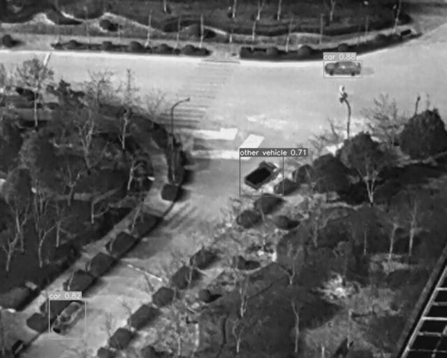
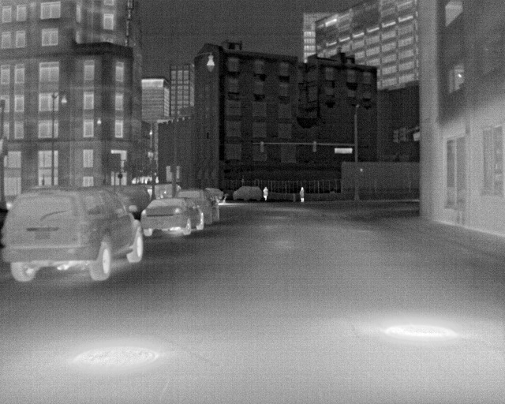
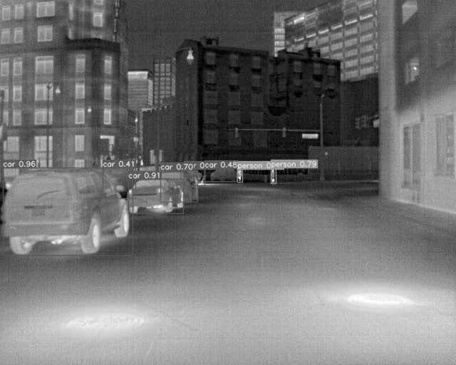
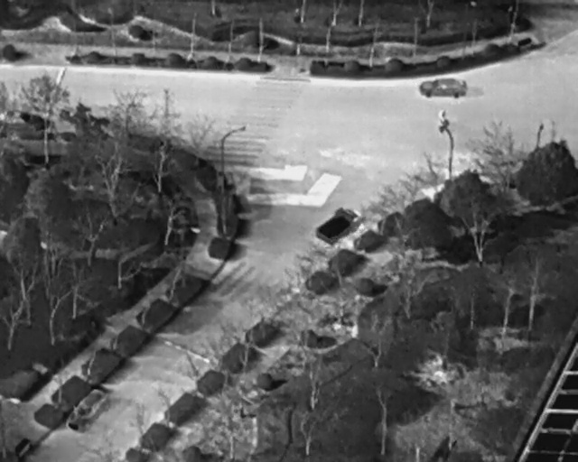

#  Cross-Domain Object Detection for UAV-based Thermal Imaging

Semester project done by Paolo Dimasi, Alberto Foti and Samuele Pino for the course 01URPOV - Machine learning for vision and multimedia at Politecnico of Turin.

## Installation


``` shell
# apt install required packages
apt update
apt install -y zip htop screen libgl1-mesa-glx

# pip install required packages
pip install -r requirements.txt

# go to code folder
cd /yolov7
```

</details>

## Testing

``` shell
python3 test.py --data data/data.yaml --img 640 --batch 32 --conf 0.001 --iou 0.65 --device 0 --weights yolov7.pt --name yolov7_640_val
```


## Training

Data preparation


``` shell
# train yolov7  models
python3 train.py --workers 32 --device 0  --batch-size 32 --data cfg/thermal-data.yaml --img 640 512 --cfg cfg/network/yolov7-tiny-silu.yaml --name yolov7-tir --hyp data/hyp.yaml  --epochs 100 "''"

```

## Transfer learning

``` shell
# finetune p5 models
python3 train.py --workers 8 --device 0 --batch-size 32 --data data/custom.yaml --img 640 512 --cfg cfg/training/yolov7-custom.yaml --weights 'best.pt' --name yolov7-pretrained--hyp data/hyp.yaml


## Inference

On video:
``` shell
python3 detect.py --weights yolov7-tir.pt --conf 0.25 --img 640 --source yourvideo.mp4
```

On image:
``` shell
python3 detect.py --weights yolov7-tir.pt --conf 0.25 --img 640 --source images/yourimage.jpg
```

<div align="center">
    <a href="./">
        
    </a>
</div>


## Teaser


<div align="center">
    <a href="./">
        
    </a>
    <a href="./">
        
    </a>
    <a href="./">
        
    </a>
    <a href="./">
        
    </a>
</div>

## Citation
As long as you cite us  you are free to use it.

## Acknowledgements

<details><summary> <b>Expand</b> </summary>

* [https://github.com/WongKinYiu/yolov7](https://github.com/WongKinYiu/yolov7)
* [https://github.com/suojiashun/HIT-UAV-Infrared-Thermal-Dataset](https://github.com/suojiashun/HIT-UAV-Infrared-Thermal-Dataset)


</details>

## Copyright
Copyright (C) 2022  Paolo Dimasi, Alberto Foti, Samuele Pino
